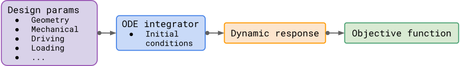

# DifFlexMM


[](https://arxiv.org/abs/2403.08078)

Differentiable Flexible Mechanical Metamaterials

TODO: Add fancy image or gif

## Why DifFlexMM?

The goal of this framework is to push the boundary of designable dynamic behaviors achievable by mechanical metamaterials.

Through the power of differentiable simulations, the frameworks removes the typical limitations of metamaterial design e.g. periodicity, intuition-based design, manual tuning, single-task design, etc. and enables the automated discovery of non-periodic, multi-functional, and reprogrammable metamaterials in the nonlinear dynamic regime.

## Overview

This repository provides a fully differentiable dynamic design framework for 2D flexible mechanical metamaterials i.e. a network of rigid units connected by flexible ligaments.
The main physical ingredients of the model are:

- Rigid-body kinematics of the units.
- Elastic ligaments modeled by customizable energy functions.
- Energy-based contact interactions between rigid units.

With these ingredients, flexible mechanical metamaterials define a rich space of nonlinear dynamic behaviors that can be navigated by the framework.

From a high-level perspective, the framework facilitates the construction of the mapping between design parameters and the desired behavior of the metamaterial system.



By leverging [JAX](https://github.com/google/jax), this complex mapping is implemented in a differentiable fashion, thus allowing gradients to flow through the entire dynamic simulation.
In particular, differentiability is provided with respect to:

- Geometric paramaters: arbitrary parametrizations can be defined in the geometry module.
- Ligament paramaters: energy functions can be defined in the energy module.
- Damping parameters: linear viscous damping as defined in the loading module.
- Driving parameters: arbitrary driving functions can be applied to any degree of freedom.
- Loading parameters: arbitrary loading functions can be applied to any degree of freedom.
- and any other paramater present in the ControlParams data structure.

## Paper

This repository contains all the code developed for the paper:
TODO: Add paper link

## Installation

Assuming you have access to the repo and ssh keys are set up in your GitHub account, you can install the package with

```bash
pip install git+ssh://git@github.com/bertoldi-collab/DifFlexMM.git
```

or you can clone the repository, `cd` into the `DifFlexMM` folder, and install with

```bash
pip install -e .
```

## Contributing

<details>
<summary><b>Expand here</b></summary>

The dependency management of the project is done via [poetry](https://python-poetry.org/docs/).

To get started:

- Install [poetry](https://python-poetry.org/docs/)
- Clone the repo
- `cd` into the root directory and run `poetry install`. This will create the poetry environment with all the necessary dependencies.
- If you are using vscode, search for `venv path` in the settings and paste `~/.cache/pypoetry/virtualenvs` in the `venv path` field. Then select the poetry enviroment as python enviroment for the project.

</details>

## Citation

If you use this code in your research, please cite the paper:

```bibtex
@article{bordiga_2024,
    title   =   {Automated discovery of reprogrammable nonlinear dynamic metamaterials},
    author  =   {Giovanni Bordiga and Eder Medina and Sina Jafarzadeh and Cyrill B\"osch and Ryan P. Adams and Vincent Tournat and Katia Bertoldi},
    year    =   {2024},
    journal =   {TBD},
    volume  =   {TBD},
    number  =   {TBD},
    pages   =   {TBD},
    doi     =   {TBD},
}
```
